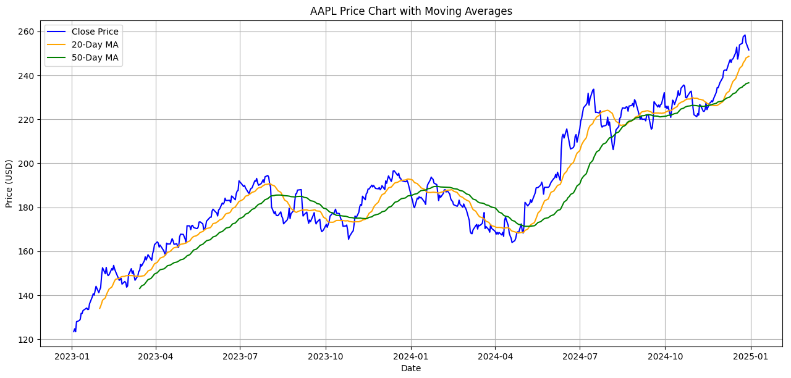

# stock-price-visualizer
Python project to pull and visualize historical stock prices using moving averages and matplotlib.

## 📈 Features
- Downloads daily OHLC data via `yfinance`
- Calculates and plots:
  - 20-day moving average
  - 50-day moving average
- Visualizes price trends with Matplotlib

## 🧠 Tools Used
- Python
- Pandas
- Matplotlib
- yfinance

## 📷 Sample Output

Built by Moses Elwon, May 2025
